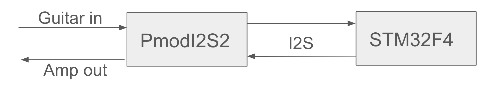
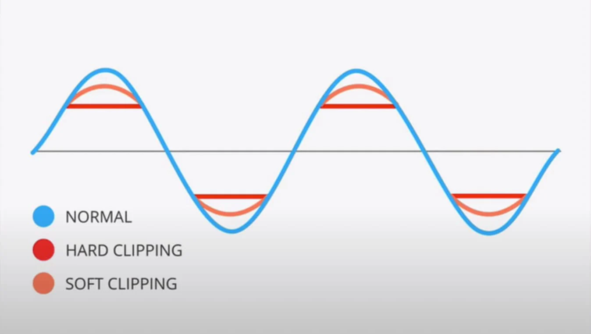

# Crafting Analog Warmth with Digital Tools: Building a Soft Clipping Overdrive and Tremolo Pedal

## Introduction: Why Guitarists Love Analog Warmth

Guitarists often describe their favorite pedals with words like _warm_, _smooth_, and _musical_. These qualities come from subtle non-linearities and frequency shaping that analog circuits introduce. But what if we could replicate that beloved analog warmth digitally?

In this project, we built a real-time digital guitar pedal on an STM32 microcontroller that implements two effects: soft clipping overdrive and amplitude modulation (tremolo). Along the way, we explored key digital signal processing (DSP) such as IR filtering to shape the tone and avoid unwanted digital harshness.

> **Figure 1.** _Block diagram of our real-time DSP guitar pedal system._  

> **Figure 2.** _A picture of our setup._  

## Problem Statement: Digital Effects Without the Digital Harshness

The challenge in digital guitar effects is avoiding artifacts that make the sound feel brittle or unnatural.

For soft clipping, naive implementations can sound harsh due to excessive high-frequency content generated by the non-linearity. For tremolo, improper design can introduce clicks and artifacting. Our main goal was to:

-   Implement **soft clipping** that sounds smooth and warm
    
-   Use **IIR filters** effectively to tame harshness and shape tone
    
-   Create a musical **tremolo** effect with clean audio output
    

## A Quick Look at Approaches in the Wild

Analog overdrive pedals (like the Ibanez Tube Screamer) use diode clipping and analog filters to shape tone. Digital plugins often use more complex waveshapers or oversampling to avoid aliasing.

For tremolo, analog designs use low-frequency oscillators (LFOs) controlling gain stages. Digital implementations must carefully modulate amplitude without introducing discontinuities.

We adopted a hybrid approach:

-   Simple **soft clipping** function for the non-linearity
    
-   **IIR filters** (biquad structure) before and after clipping to mimic the frequency shaping of analog pedals
    
-   **Sine wave LFO** for smooth tremolo
    

## How We Used IIR Filters to Shape the Tone

### Why Filtering Matters

Clipping generates harmonics — this is what gives overdrive its richness. But too many high-frequency harmonics can make the sound brittle. Analog pedals naturally filter out excess highs. In digital, we use filters deliberately for the same reason.

### Our Filter Design

We implemented IIR filters in two places:

-   **Pre-filter:** A high-pass filter that removes some lows before clipping, preventing the signal from sounding muddy (too much low end sound).

-   **Post-filter:** A high-pass filter that smooths the output tone and prevents the.

Using IIR filters keeps our CPU usage low (essential for real-time performance on STM32) compared to other filtering methods such as FIR filters, while giving us flexible control over tone shaping.

### Tuning the Filters

We tuned the cutoff frequencies by ear:

-   **Pre-filter cutoff:** around 700 - 1200 Hz to tame the low end

-   **Post-filter cutoff:** around 3–5 kHz to remove harsh high frequencies

This step was critical — small tweaks made a big difference in perceived sound quality and warmth.

## Soft Clipping: Non-Linearity for Analog Feel

Our soft clipping function compresses signals that go beyond a threshold, avoiding the hard cutoff that creates harsh distortion.

We used a simple symmetrical function that compresses highs smoothly. When combined with our IIR filtering, this produced a tone that feels dynamic but controlled.

> **Figure 2.** _Waveform comparison: Clean vs. Soft Clipped vs. Hard Clipped signals._

## Tremolo: Modulating Amplitude the Smooth Way

For the tremolo effect, we applied a **sine wave LFO** to modulate the amplitude of the processed signal. To avoid clicks and ensure smooth modulation:

-   A sine oscillator was used
-   We applied the LFO to modulate gain multiplicatively

> **Figure 4.** _Amplitude envelope showing tremolo modulation over time._

By carefully choosing LFO frequency (typically 3–8 Hz) and depth, we created a musical tremolo that complements the overdrive rather than competing with it.

## Key Insights & Takeaways

-   **IIR filters** were incredibly useful: By carefully placing filters before and after clipping, we controlled tone and avoided digital harshness.
    
-   **Soft clipping** with filtering can produce overdrive tones that feel warm and dynamic, much like analog pedals.
    
-   **Amplitude modulation** (tremolo) needs smooth LFOs to sound musical.
    
-   DSP design choices (filter cutoff, clipping curve shape, LFO implementation) make _big_ differences in perceived sound quality.
    

## Strengths, Limitations, and Future Directions

### Strengths

-   Real-time processing on a microcontroller (STM32) with low latency
    
-   Uses standard DSP techniques (IIR filters, soft clipping) effectively
    

### Limitations

-   We used fixed filter parameters; a future version could have user-adjustable tone controls.
    
-   Different kinds of clipping characteristics could be experimented with.
    
-   We could not get a working version of a FIR filter. 

### Ideas for Future Work

-   Implementing user-controllable EQ using more IIR filter stages
    
-   Adding other modulation effects (e.g., chorus) using delay lines
    

## Supplemental Materials

All code and filter design scripts are available on [GitHub](https://github.com/msongweiss/DSP-Effects-Pedal). Raw data and STM32 project files are included in the repository.

----------

